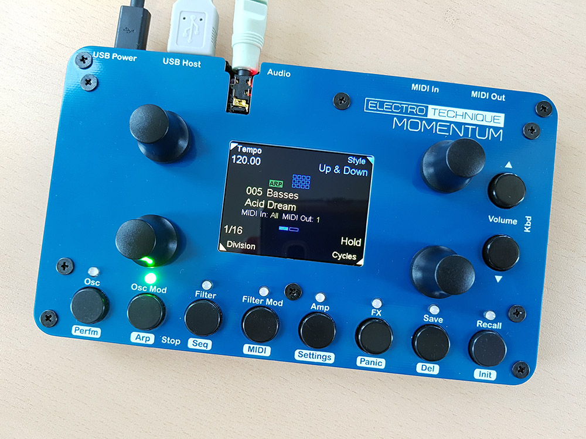
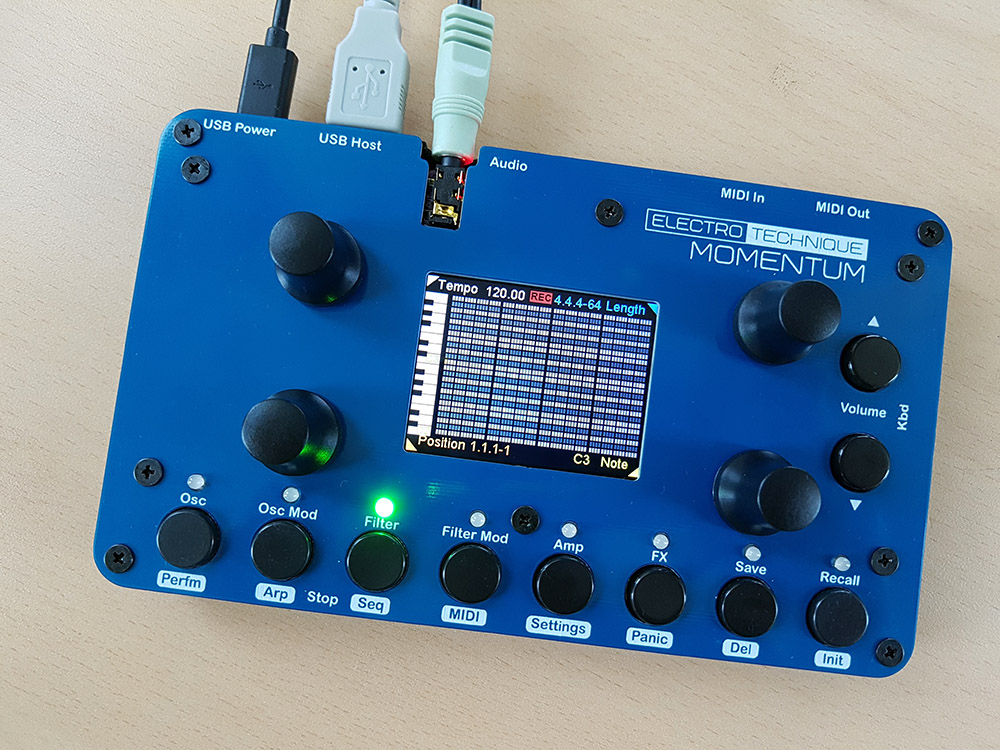

[MOMENTUM](https://electrotechnique.cc/Momentum)    -    [TSYNTH](https://electrotechnique.cc/TSynth)     -    [NEWS](https://electrotechnique.cc/News) -    [BUY](https://www.tindie.com/stores/electrotechnique/)

## DIY 12-voice virtual analogue polyphonic synthesizer based on [TSynth](https://electrotechnique.cc/TSynth)

# Specifications  

- Teensy Micromod-based 600MHz MCU
- PCM5102A 16 bit, 44.1 kHz  analogue stereo out
- USB client (power in), USB Host
- MIDI TRS In and Out/Thru (In is type A and B, Out is type A)
- Four encoders, 10 buttons
- 320x240 TFT colour display
- SD card socket

<table border: none>
  <tr>
    <td></td>
    <td></td>
  </tr>
</table>

Oscillators
- 12 voice polyphony (last note priority), two oscillators per voice, velocity sensitive, detunable with +/- 2 octaves range, Sine/Sample & Hold (like tuned noise)/Square/Sawtooth/Ramp/PWM/Var Triangle/User waveforms and level. Square, Sawtooth and Pulse waves are band-limited.
- Pulse Width/Var Triangle can be set for each oscillator with PWM by a dedicated LFO or from the filter envelope
- Pink or white noise level
- Dedicated LFO for pitch mod (can be retriggered by note on), Sine/Triangle/Sawtooth/Ramp/Square/S&H waveforms
- Pitch can be modulated by filter envelope (+/-)
- Oscillator FX - XOR creates lots of harmonics with certain waveforms and X Mod 'Cross Modulation' bell-like sounds.
- Dynamic Unison with all 24 oscillators detunable from each other - one, two, three or four notes can be played with oscillators distributed among them
- Chord Unison with all oscillators playing a chord selected from detune control - major, minor, diminshed...
- Monophonic mode - first, last, highest, lowest note priorities.
- Polyphonic Glide with variable time

Filter
- State variable 12dB filter (SVF) with continuous mix between LP and HP (provides notch filter) and BP
- Cutoff freq and resonance
- Cutoff can be modulated by dedicated exponential ADSR envelope (+/-), dedicated LFO
- LFO has same waveforms as pitch LFO (can be retriggered by note on)  and rate can be set to match MIDI clock (tempo) with variable time division (1,3/4,1/2,1/4,1/8...)
- Key tracking adjustable up to full

Amplifier
- Dedicated ADSR envelope with exponential attack (adjustable), decay and release stages

Effects
- Stereo ensemble chorus - very good quality with mix and rate control
- Simple reverb with mix and size

Patch storage
- 8 user-nameable banks with 128 patches in each, stored on SD card

Performance
- 128 user-nameable performance memories allowing patch, MIDI settings and assignment of the four encoders to the patch parameters

Arppegiator
-  Six styles (up, down, bounce, up & down, random, play order), choice of ranges, base octave, tempo and tempo divisions
-  Syncable to incoming MIDI clock

Sequencer
- Simple step sequencer, length up to 64 notes, 
- Syncable to incoming MIDI clock
- 128 user-nameable sequences stored on SD card

MIDI
- USB HOST MIDI Class Compliant (direct connection to MIDI controller, no PC needed)
- USB Client MIDI In from PC
- MIDI TRS In (type A and B)
- MIDI TRS Thru/Out (type A)  - configurable as a thru with filtering options or an out

Audio
- PCM5102A 16 bit, 44.1 kHz  analogue stereo out
- USB digital audio out, appears as 16 bit, 44.1 kHz audio interface on PC
