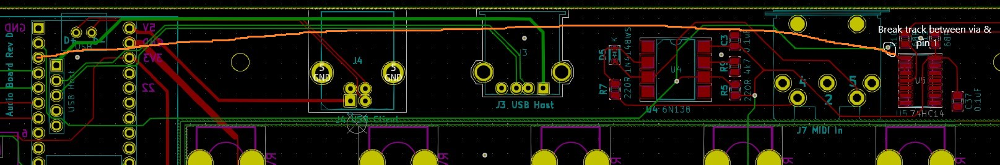

**Modify V1.2 PCB to V1.3**

 **1**  Soft MIDI Thru/Out - You need to take the front panel off to work on the top side of the PCB. Break the track between the via and pin 1 of the 74HC04 Hex Inverter. Solder a wire between pin 3 (TX) of the Teensy and pin 1 of the 74HC04 Hex Inverter. See the User Manual for how the MIDI Thru/Out setting works.

 **2**  Display backlight control (nothing in the firmware to control this yet) - Solder a wire between pin 6 of the Teensy and the BL (backlight) pin of the display.

 **3** Display SCL (clock) noise - breaking the SCL track to the display on the bottom of the PCB and soldering a 100 ohm resistor has been found to cut down on some of the noise on the analogue output at high volume. A small SMD resistor is best. On the V1.3 PCB, the track has been re-routed slightly and has the resistor.

